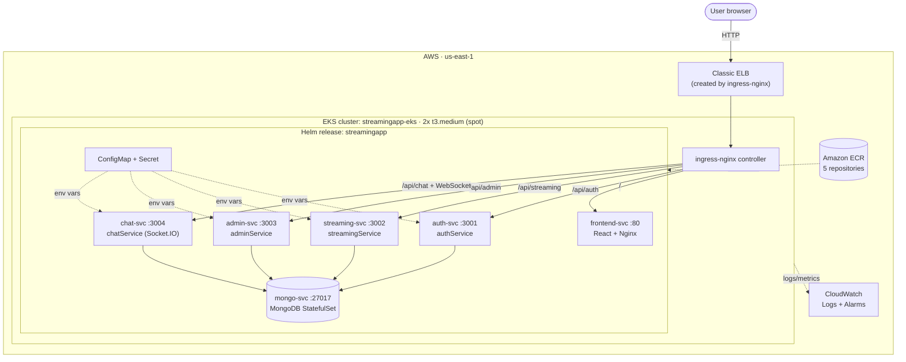
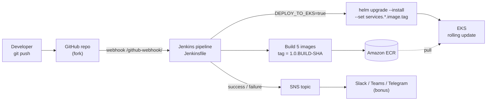

# StreamingApp – Architecture

Diagrams are written in Mermaid and render directly on GitHub.

## 1. System architecture (runtime)

## 2. CI/CD flow

## 3. Request routing (Ingress)

| Path | Backend Service | Port | Purpose |
|---|---|---|---|
| `/` | `frontend-svc` | 80 | React SPA served by Nginx |
| `/api/auth` | `auth-svc` | 3001 | Register, login, JWT (rewritten `/api/auth/*` → `/api/*`) |
| `/api/streaming` | `streaming-svc` | 3002 | Catalogue and playback |
| `/api/admin` | `admin-svc` | 3003 | Uploads and curation |
| `/api/chat` (+ WebSocket) | `chat-svc` | 3004 | Live chat |

## 4. Components

| Component | Kind | Image (ECR repo) | Notes |
|---|---|---|---|
| authService | Deployment + ClusterIP Service | `streaming-auth` | JWT issuance |
| streamingService | Deployment + ClusterIP Service | `streaming-streaming` | Video catalogue, S3 playback |
| adminService | Deployment + ClusterIP Service | `streaming-admin` | Asset management |
| chatService | Deployment + ClusterIP Service | `streaming-chat` | WebSocket + REST |
| frontend | Deployment + ClusterIP Service | `streaming-frontend` | API URLs baked at build time via `--build-arg` |
| MongoDB | StatefulSet + headless Service (`mongo-svc`) | `mongo` | Currently `emptyDir` (see limitations) |
| Config | ConfigMap, Secret | – | Ports, CORS/client URLs, region, bucket; JWT and AWS keys |

All Deployments use `RollingUpdate` with `maxUnavailable: 0`, `maxSurge: 1`, plus readiness and liveness probes, so upgrades and scaling do not drop traffic.

## 5. Monitoring and logging

- **Logs:** container logs shipped to CloudWatch Logs (log groups per service).
- **Metrics/alarms:** CloudWatch alarm `EKS-High-CPU-Utilization` (CPU > 80% for 5 min), using the node group's Auto Scaling Group as the dimension.
- **Alerts (bonus):** Jenkins publishes success/failure events to an SNS topic, which fans out to a chat platform.

## 6. Design decisions

- **Helm for everything:** one chart, one `values.yaml`; image repository/tag, replicas, ports, ingress host are all values.
- **Immutable tags:** Jenkins tags images `1.0.<build>-<git sha>`, so `pullPolicy: IfNotPresent` is safe and every deploy is traceable to a commit.
- **Frontend host is a build-time input:** React inlines API URLs at build, so the same `INGRESS_HOST` is used for the frontend build arg and the Ingress rule.
- **Spot nodes:** cheapest option for a demo cluster; not suitable for production.
